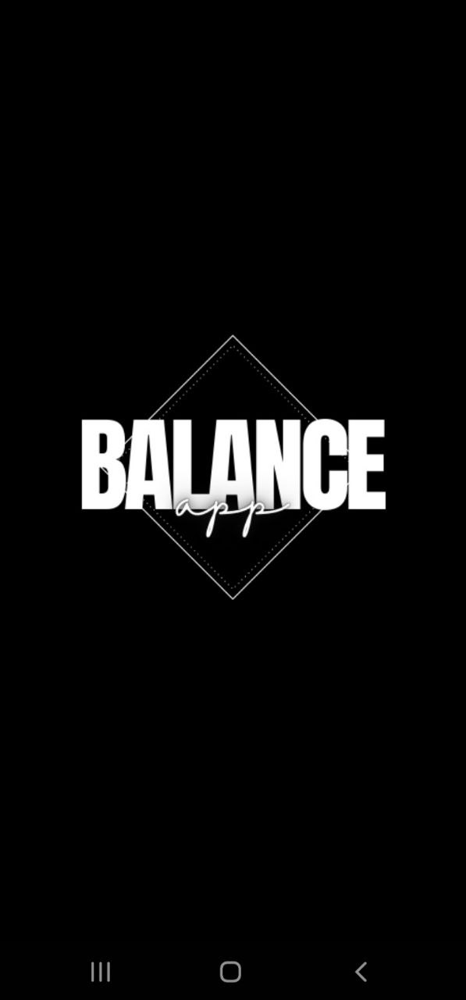

BalanceApp – Screen Time Management and Digital Well-Being

Overview
BalanceApp is a mobile/web application designed to help users manage their screen time effectively and improve their digital well-being. It offers features such as usage tracking, goal setting, and personalized tips.   

Features
- Real-time screen time tracking
- Customizable usage limits and notifications
- Analytics and trends visualization
- Digital well-being tips and recommendations
- User-friendly and responsive interface

Installation
1. Clone the repository:
https://github.com/Charan545/BalanceApp.git

2. Navigate to the project directory:
cd BalanceApp

3. Install dependencies:
npm install

4. Run the app:
npm start
 
               Project Report  
BalanceApp: Screen Time Management and Digital Well-Being 
 
Introduction 
The BalanceApp project is a screen time management application 
designed to help users monitor and control their digital device usage. 
Developed using Java in Android Studio, BalanceApp offers an 
intuitive and user-friendly experience by tracking app usage, 
providing insights into daily screen time habits, and helping users 
achieve a balanced digital lifestyle. By focusing on screen time 
awareness, BalanceApp promotes a healthier approach to technology 
use, helping users find a balance between productivity, leisure, and 
digital wellness. 
Objective 
The objective of BalanceApp is to empower users with tools to 
monitor and reduce unnecessary screen time. The application 
provides features like app usage tracking, daily screen time goals, 
visual representations of screen time data, and personalized 
recommendations for reducing screen exposure. By giving users 
insights into their digital habits, BalanceApp encourages a balanced 
lifestyle that reduces digital fatigue and supports mental well-being. 
Technologies Used 
• Backend: Java (in Android Studio) 
• Frontend: XML for layouts, Android Views, and Widgets 
2 
 
• Database: SQLite (for storing user settings, goals, and usage 
data) 
• Additional Libraries: MPAndroidChart for data visualization, 
Android Room for local database management, Firebase for 
analytics. 
 
 
Features and Functionalities 
1. User Registration and Login 
•   Registration: Users create an account to personalize their 
experience. 
•   Login: Secure access to individual data and app usage history. 
•   Authentication and Authorization: Ensures secure access to 
user-specific data. 
2. Personalized Profile Setup 
• Users enter preferences for daily screen time limits and usage 
goals. This customization tailors the app’s notifications and daily 
reminders to fit individual user needs. 
3. Screen Time Tracking 
•   BalanceApp continuously monitors app usage and logs total 
screen time daily. 
•   Users can view screen time details for each app, categorized 
by usage type (e.g., social, productivity).   
4. Data Visualization with Charts 
•  Using MPAndroidChart, the app visualizes screen time data, 
displaying usage trends over days, weeks, and months. 
3 
 
•  Bar charts and line graphs help users understand their screen 
time patterns, making it easier to identify problematic habits.  
5. Daily Screen Time Goal Setting 
•  Users can set daily screen time limits, with notifications and 
reminders when approaching or exceeding these limits. 
•  BalanceApp encourages users to stay within their set screen 
time goals, promoting mindful technology usage. 
 
6. Performance Calendar 
• A  built-in calendar allows users to track their screen time 
adherence and visualize consistency over time. 
• Users can view which days they met their goals and where they 
exceeded limits, promoting accountability and motivation. 
 
7. Focus Mode 
•  Focus Mode temporarily restricts access to selected distracting 
apps, helping users concentrate on tasks. 
•  Users can schedule Focus Mode sessions for study, work, or 
other non-digital activities. 
8. Usage Insights and Recommendations 
• Based on usage patterns, BalanceApp provides tips for reducing 
screen time, like app usage limits or taking regular breaks. 
• Suggestions are based on personalized trends and user goals, 
offering actionable steps for digital well-being. 
 
 
4 
 
Application Workflow 
 
1.  User Registration/Login: Users create an account or log in to 
access personalized screen time data. 
2.  Profile Setup: Users set preferences for screen time goals and 
usage tracking. 
3.  Screen Time Monitoring: BalanceApp tracks app usage, 
displaying detailed insights for each app. 
4.  Goal Setting and Reminders: Users set daily screen time goals, 
with notifications to alert them of excessive usage. 
5.  Performance Tracking: The performance calendar shows daily 
and weekly adherence to screen time goals. 
6.  Focus Mode Activation: Users activate Focus Mode to limit 
distractions during specified times. 
7.  Usage Insights and Recommendations: The app provides insights 
based on usage trends, helping users adjust digital habits. 
 
 
Implementation Details 
•   Backend: Java is used for implementing core functionalities, 
including tracking app usage and managing user goals. 
Android's Room library handles local data storage, enhancing 
data integrity and retrieval. 
•   Frontend: XML layouts and Android Views create a user
friendly interface. MPAndroidChart is used for visualizing data, 
while RecyclerView displays app usage details efficiently. 
5 
 
• Database Management: SQLite is used to store user goals, 
screen time logs, and app settings. Android Room ORM 
provides an abstraction over SQLite, making data operations 
simpler and more efficient. 
 
 
Challenges and Solutions 
1.  Real-Time App Usage Tracking: Tracking screen time in real-time 
without draining battery life was challenging. This was optimized 
using Android’s UsageStatsManager, which periodically collects app 
usage data, minimizing resource consumption. 
2.  Data Visualization: Presenting screen time trends visually 
required integrating the MPAndroidChart library and managing 
large datasets efficiently. MPAndroidChart’s caching and animation 
capabilities helped in creating responsive, visually appealing charts. 
3.  User Data Security: Protecting user data and preferences is 
crucial for user trust. Secure storage practices, such as using 
Android’s encrypted storage options, were implemented to 
safeguard user privacy. 
 
 
Future Scope 
1.  Cross-Platform Compatibility: Expanding BalanceApp to iOS 
would increase accessibility for users with multiple devices. 
2.  Advanced Analytics and Insights: Integrating machine learning 
could provide users with predictive insights, such as projecting 
weekly usage patterns based on past data. 
6 
 
3.  Gamification of Screen Time Goals: Adding achievements and 
rewards for meeting screen time goals could motivate users to 
engage more actively with the app. 
 
 
Conclusion 
The BalanceApp project effectively addresses the challenges of 
managing screen time and promoting digital well-being. With 
features like goal setting, usage tracking, performance calendars, and 
data visualization, BalanceApp empowers users to adopt healthier 
digital habits. This project showcases the potential of mobile 
technology in supporting balanced lifestyle choices and sets the 
foundation for future advancements in the field of digital wellness. 
